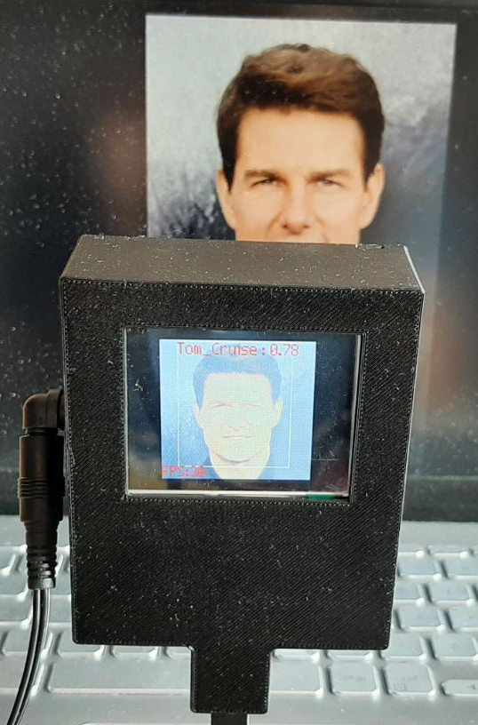
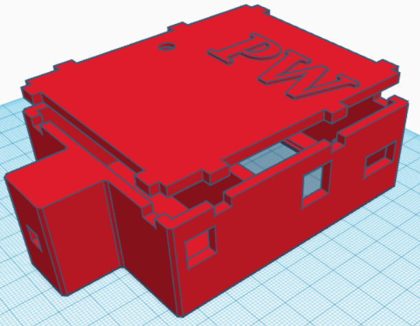

# Device for detecting a specific person based on the YOLO model

Generated model name is model-20565.nncase__MAIXHUB_TOM_CRUISE_MODEL_200_images

The project was created using the maixhub.com page.
The main goal of this work was to test the possibility of face detection technology on the Kendryte K210 chip.

The chip Kendryte K210 can be programmed on the microPython language. 

The neural network that was used in this project is YOLOv2. To make a model you need have a dataset of the person you have chosen. In my case that was Tom Cruise. In addition, I made later model for detecting 2 persons. On the images below you can see results of detection.

# Images

  
  

The casing was also designed to connect all the components together. The designed housing also includes a place for a 9V battery and a hole for the screen:

  

# Testing the model with different image filters
Also I made some kind of analysis of working of this system under influence of external factors. Below you can see some graphs. 

For example on this graph you can see how different types of transformations of image can influence on detection:

On this graph you can see how the brightness of the displayed actor's photo affects the probability of detection:

